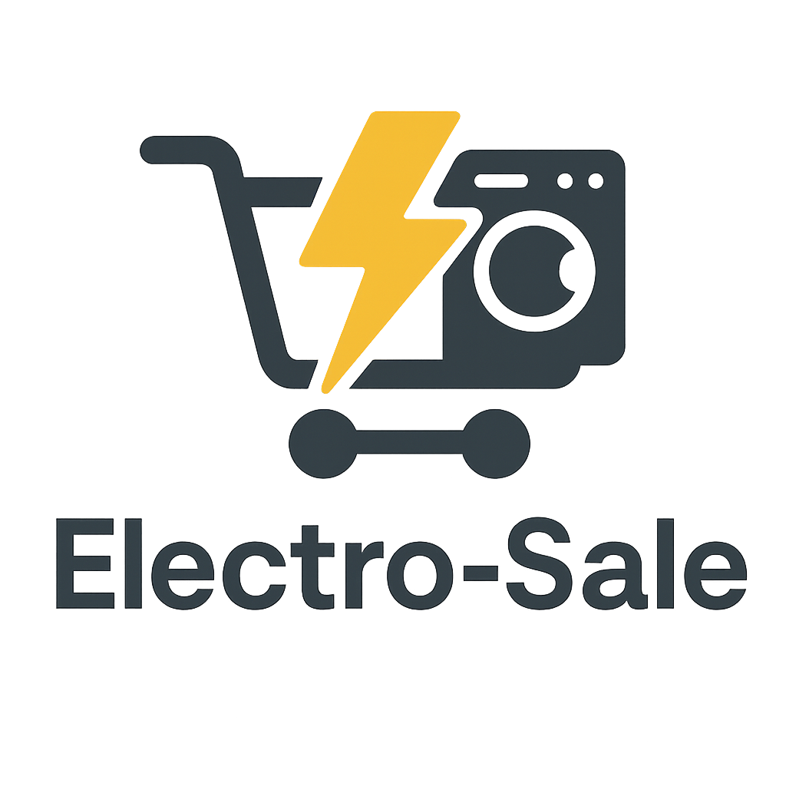

# ⚡ Electro-Sale  

<p align="center">
  
</p>


---

## 🛒 About the Project  
**Electro-Sale** is a full-stack **e-commerce web application** focused on selling electronic products online.

This project is being built as a **real-world learning experience**, with a strong emphasis on backend development, database design, and server-side logic.

The goal is to create a scalable and secure platform that handles users, products, carts, and orders efficiently.

---

## ✨ Features  
✅ Dynamic product catalog  
✅ User registration and authentication  
✅ Shopping cart functionality  
✅ Backend API built with Node.js and Express  
✅ MySQL database integration  
✅ Frontend built with vanilla HTML, CSS, and JavaScript  

---

## 🧠 What I’m Learning  
- Backend architecture with Node.js and Express  
- RESTful API design  
- SQL database modeling and queries  
- Authentication and user management  
- Connecting frontend and backend logic  

---

## 🖥️ Tech Stack  
- **Frontend:** HTML5, CSS3, JavaScript  
- **Backend:** Node.js, Express  
- **Database:** MySQL  
- **Version Control:** Git & GitHub  

---

## ⚙️ Installation  

1. Clone the repository:
   ```bash
   git clone https://github.com/edgardodev/electro-sale.git

